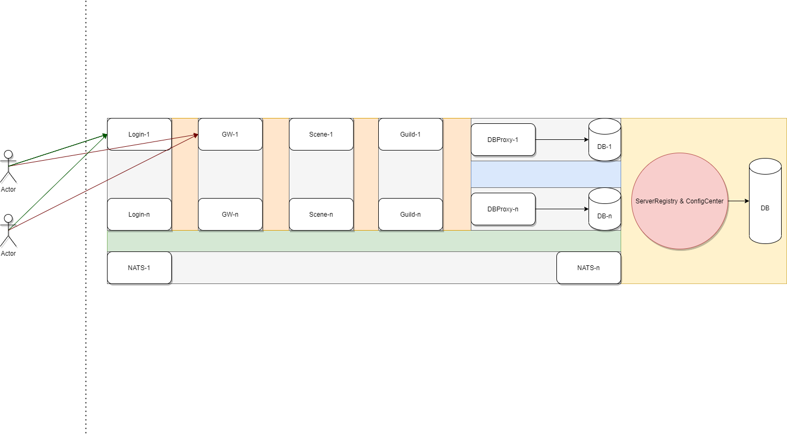

[# Welcome to APie!](https://github.com/wuqunyong/APie)

# CentOS 7 x64安装
## 依赖

 - libevent
 - protobuf
 - yaml
 - lz4
 - [cpp_redis](https://github.com/cpp-redis/cpp_redis)
 - [nats.c](https://github.com/nats-io/nats.c)

## 安装依赖
```shell
yum install -y mysql-devel mysql-server lrzsz curl-devel openssl openssl-devel readline-devel pcre pcre-devel zlib zlib-devel gcc gcc-c++ rpm-build automake libtool lz4-devel

ssh-keygen -t ed25519 -C "your_email@example.com"
eval "$(ssh-agent -s)"
ssh-add ~/.ssh/id_ed25519
cat ~/.ssh/id_ed25519.pub
```
### 升级GCC
```shell
yum install centos-release-scl-rh -y
yum install devtoolset-11 -y
scl enable devtoolset-11 bash
gcc --version
```
## 安装git
```
yum install -y git
git --version
```
## clone项目
```
cd /root/
git clone git@github.com:wuqunyong/freeze.git
cd freeze
git branch -a
git checkout future_lite
git pull
cd /root/freeze/download/
cp cmake-3.18.1-Linux-x86_64.tar.gz /root/
cp protobuf-3.21.6.zip /root/
cp yaml-cpp-yaml-cpp-0.7.0.zip /root/
cp libevent-release-2.1.11-stable.zip /root/
cd /root/
```
### 安装cmake
```shell
tar -zxvf cmake-3.18.1-Linux-x86_64.tar.gz
cd cmake-3.18.1-Linux-x86_64
```

### 安装protobuf
```shell
unzip protobuf-3.21.6.zip
cd protobuf-3.21.6
./autogen.sh
./configure --prefix=/usr/local/protobuf/
make
# make check
make install
ldconfig
```
### 安装yaml
```shell
unzip yaml-cpp-yaml-cpp-0.7.0.zip
cd yaml-cpp-yaml-cpp-0.7.0
mkdir build && cd build
/root/cmake-3.18.1-Linux-x86_64/bin/cmake ..
make
# make test
make install


error: ‘dummy’ may be used uninitialized
```

## 安装cpp_redis
```
# Clone the project
git clone git@github.com:Cylix/cpp_redis.git
# Go inside the project directory
cd cpp_redis
# Get tacopie submodule
git submodule init && git submodule update
# Create a build directory and move into it
mkdir build && cd build
# Generate the Makefile using CMake
/root/cmake-3.18.1-Linux-x86_64/bin/cmake .. -DCMAKE_BUILD_TYPE=Release
# Build the library
make
# Install the library
make install

#include<thread>

```

### 安装nats
```shell
#libevent libevent-devel 依赖libevent 2.1版本

git clone git@github.com:nats-io/nats.c.git
cd nats.c/
mkdir build && cd build
/root/cmake-3.18.1-Linux-x86_64/bin/cmake .. -DNATS_BUILD_STREAMING=OFF -DNATS_BUILD_TLS_USE_OPENSSL_1_1_API=OFF
make
make install
```

### 安装libevent
```shell
unzip libevent-release-2.1.11-stable.zip
cd libevent-release-2.1.11-stable
mkdir build && cd build
/root/cmake-3.18.1-Linux-x86_64/bin/cmake ..
make
make install
```


## 编译
```shell
$ mkdir build && cd build
$ /root/cmake-3.18.1-Linux-x86_64/bin/cmake ..
$ make
$ make install

# /root/cmake-3.18.1-Linux-x86_64/bin/cmake .. -DCMAKE_CXX_COMPILER=$(which g++)  
```


## CentOS7 x64安装MySQL
[# How To Install MySQL on CentOS 7](https://www.digitalocean.com/community/tutorials/how-to-install-mysql-on-centos-7)
In a web browser, visit:
```
https://dev.mysql.com/downloads/repo/yum/
```
###  Step 1 — Installing MySQL
```
wget https://dev.mysql.com/get/mysql57-community-release-el7-9.noarch.rpm
md5sum mysql57-community-release-el7-9.noarch.rpm
rpm -ivh mysql57-community-release-el7-9.noarch.rpm
yum install mysql-server
```

### Step 2 — Starting MySQL
```
systemctl start mysqld
systemctl status mysqld
grep 'temporary password' /var/log/mysqld.log
```

### Step 3 — Configuring MySQL
```
mysql_secure_installation
```
### Step 4 — Testing MySQL
```
mysqladmin -u root -p version
```

# Windows安装
安装依赖库protobuf-3.21.6.zip
直接visual studio启动，编译

# 架构图


# Reactor线程模型
 [nio reactor](http://gee.cs.oswego.edu/dl/cpjslides/nio.pdf)

# Demo
```cpp
#include <cstdlib>
#include <string>
#include <iostream>
#include <map>
#include <vector>
#include <algorithm>
#include <tuple>

#include "apie.h"
#include "pb_init.h"

class GatewayMgr
{
public:
	GatewayMgr(std::string name, apie::module_loader::ModuleLoaderBase* prtLoader)
	{
		m_name = name;
		m_prtLoader = prtLoader;
	}

	static std::string moduleName()
	{
		return "GatewayMgr";
	}

	static uint32_t modulePrecedence()
	{
		return 1;
	}

	apie::status::Status init()
	{
		return { apie::status::StatusCode::OK, "" };
	}
	apie::status::Status start()
	{
		return { apie::status::StatusCode::OK, "" };
	}
	apie::status::Status ready()
	{
		using namespace ::login_msg;
		S_REGISTER_REQUEST(Echo, GatewayMgr::handleEcho);

		return { apie::status::StatusCode::OK, "" };
	}
	apie::status::Status exit()
	{
		return { apie::status::StatusCode::OK, "" };
	}

	void setHookReady(apie::hook::HookPoint point)
	{
		if (m_prtLoader->getHookReady(point))
		{
			return;
		}

		m_prtLoader->setHookReady(point);
	}

public:
	static apie::status::E_ReturnType handleEcho(
		apie::MessageInfo info, const std::shared_ptr<::login_msg::EchoRequest>& request, std::shared_ptr<::login_msg::EchoResponse>& response)
	{
		auto value1 = request->value1();
		auto value2 = request->value2();

		response->set_value1(value1);
		response->set_value2(value2);

		return apie::status::E_ReturnType::kRT_Sync;
	}

private:
	std::string m_name;
	apie::module_loader::ModuleLoaderBase* m_prtLoader;
};


int main(int argc, char** argv)
{
	if (argc != 2)
	{
		PANIC_ABORT("usage: exe <ConfFile>, Expected: {}, got: {}", 2, argc);
	}

	APieRegisterModule<GatewayMgr>();

	std::string configFile = argv[1];
	apie::CtxSingleton::get().init(configFile);
	apie::CtxSingleton::get().start();
	apie::CtxSingleton::get().waitForShutdown();

	return 0;
}

```

## RPC调用

来看第一个RPC例子, 提供Callback和Coroutine的两种RPC调用

| 对象 | 操作 | 对象 | 操作 | 对象 |
| --- | --- | --- | --- | --- |
| ***Client*** | 1.Request | ***GatewayServer*** | 2.RPCRequest(Callback或Coroutine) | ***SceneServer*** |
| ***Client*** | 4.Response| ***GatewayServer*** | 3.RPCResponse                     | ***SceneServer*** |

### Client

```
//发送AsyncEcho 客户端请求
::login_msg::AsyncEchoRequest request;
request.set_value1(123);
request.set_value2("hello");
mockRole.sendMsg(pb::core::OP_AsyncEchoRequest, request);
```

### GatewayServer

```
//注册AsyncEcho 客户端请求处理
S_REGISTER_REQUEST(AsyncEcho, GatewayMgrModule::handleAsyncEcho);

apie::status::E_ReturnType GatewayMgrModule::handleAsyncEcho(
	MessageInfo info, const std::shared_ptr<::login_msg::AsyncEchoRequest>& request, std::shared_ptr<::login_msg::AsyncEchoResponse>& response)
{
	auto iValue = request->value1();
	if (iValue % 2 == 0)
	{
		AsyncEcho_Coroutine(info, request, response);
	}
	else
	{
		AsyncEcho_RPC(info, request, response);
	}
	return apie::status::E_ReturnType::kRT_Async;
}

CoTaskVoid AsyncEcho_Coroutine(MessageInfo info, const std::shared_ptr<::login_msg::AsyncEchoRequest>& request, std::shared_ptr<::login_msg::AsyncEchoResponse>& response)
{
	auto dataResponse = response;

	::rpc_msg::CHANNEL server;
	server.set_realm(apie::Ctx::getThisChannel().realm());
	server.set_type(::common::EPT_Scene_Server);
	server.set_id(1);

	pb::rpc::RPC_EchoTestRequest params;
	params.set_value1(request->value1());
	params.set_value2(request->value2() + " coroutine");

	//发送EchoTest RPC请求
	auto ptrAwait = MakeCoAwaitable<pb::rpc::RPC_EchoTestRequest, pb::rpc::RPC_EchoTestResponse>(server, pb::rpc::OP_RPC_EchoTest, params);
	auto coResponse = co_await *ptrAwait;
	if (!coResponse.ok())
	{
		co_return;
	}

	dataResponse->set_value1(coResponse.value().value1());
	dataResponse->set_value2(coResponse.value().value2());

	info.iOpcode = info.iResponseOpcode;
	apie::network::OutputStream::sendProtobufMsgImpl(info, *dataResponse);
}

void AsyncEcho_RPC(MessageInfo info, const std::shared_ptr<::login_msg::AsyncEchoRequest>& request, std::shared_ptr<::login_msg::AsyncEchoResponse>& response)
{
	::rpc_msg::CHANNEL server;
	server.set_realm(apie::Ctx::getThisChannel().realm());
	server.set_type(::common::EPT_Scene_Server);
	server.set_id(1);

	pb::rpc::RPC_EchoTestRequest params;
	params.set_value1(request->value1());
	params.set_value2(request->value2() + " rpc");

	auto cb = [info, response](const apie::status::Status& status, const std::shared_ptr<pb::rpc::RPC_EchoTestResponse>& data) mutable {
		if (!status.ok())
		{
			return;
		}

		std::stringstream ss;
		ss << "RPC_echoCb:" << data->ShortDebugString();

		response->set_value1(data->value1());
		response->set_value2(data->value2());

		info.iOpcode = info.iResponseOpcode;
		apie::network::OutputStream::sendProtobufMsgImpl(info, *response);
	};
	//发送EchoTest RPC请求
	apie::rpc::RPC_Call<pb::rpc::RPC_EchoTestRequest, pb::rpc::RPC_EchoTestResponse>(server, pb::rpc::OP_RPC_EchoTest, params, cb);
}
```

### SceneServer

```
//注册EchoTest RPC服务
INTRA_REGISTER_RPC(EchoTest, SceneMgrModule::RPC_echoTest);

apie::status::Status SceneMgrModule::RPC_echoTest(const ::rpc_msg::CLIENT_IDENTIFIER& client, const std::shared_ptr<pb::rpc::RPC_EchoTestRequest>& request, std::shared_ptr<pb::rpc::RPC_EchoTestResponse>& response)
{
	response->set_value1(request->value1());
	response->set_value2(request->value2() + " scene");

	return { apie::status::StatusCode::OK, "" };
}
```